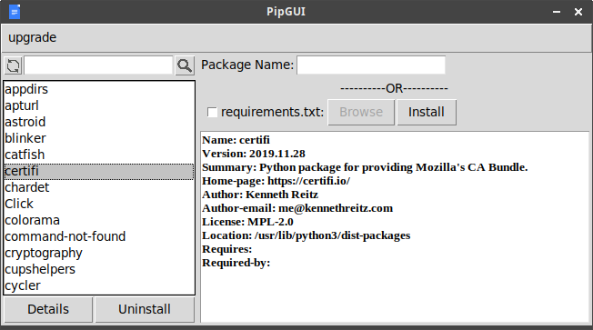

# PipGUI
Python3 pip GUI Package Manager  
GUI based python pip package manager to manage virtual environments.

Tools: python3.8, tkinter

Functionalities:
1.Upgrade pip  
2.Install packages  
3.Uninstall packages  
4.Install from requirements.txt  
5.Show installed packages details.  

Note: &nbsp;Activate virtual environment from terminal and then run pipgui.py file from terminal. 
&nbsp;&nbsp;&nbsp;&nbsp;&nbsp;&nbsp;&nbsp;&nbsp;&nbsp;&nbsp;
Commands: workon \<environment_name\>; python3 pipgui.py

 

